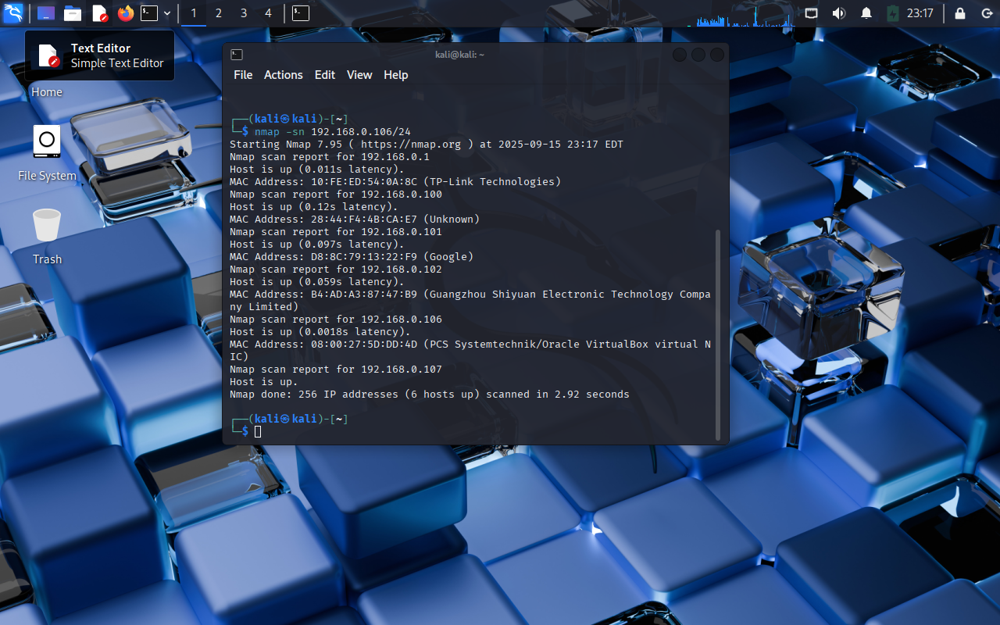
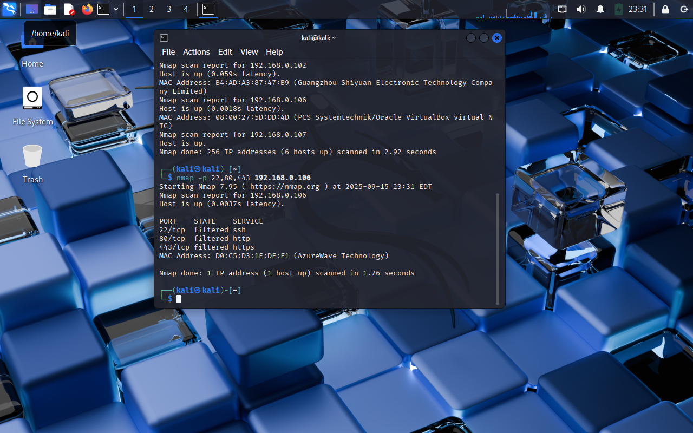

# Laboratorio de Escaneo de Red con Nmap

**Autor:** Jesús Eduardo Machuca Quintero
**Fecha:** 15 Sep 2025
**Objetivo:** Documentar el uso de Nmap para reconocimiento de red como evidencia para el portafolio de ciberseguridad (rol: Analista SOC).

---

## 📌 Resumen

En este laboratorio se simuló un entorno con una máquina atacante (Kali) y una máquina víctima (Ubuntu). Se realizaron escaneos de descubrimiento, puertos y detección de servicios con Nmap. Se documentaron los comandos usados, las capturas y las salidas para evidencia.

---

## 🧩 Entorno del laboratorio

* Máquina atacante (Kali): `192.168.0.7` (según tu README original)
* Máquina víctima (Ubuntu): `192.168.0.106`
* Virtualización: VirtualBox (modo NAT/Bridge según configuración)
* Archivos del repo:

  * `images/` — capturas (ej: `01_discovery.png`, `02_ports.png`, `03_services.png`)
  * `outputs/` — salidas guardadas por nmap (ej: `01_discovery.txt`, `02_ports.txt`, `03_full-scan.*`)
  * `scripts/scan.sh` — script para reproducir escaneos
  * `README.md`, `HOW_TO_RUN.md`

---

## 🛠 Comandos ejecutados (ejemplos y salidas)

### 1) Descubrimiento de hosts (ping sweep)

Comando:

```
nmap -sn 192.168.0.0/24 -oN outputs/01_discovery.txt
```


Salida clave (extracto):

* Hosts up: `192.168.0.1`, `192.168.0.100`, `192.168.0.101`, `192.168.0.102`, **`192.168.0.106`**, `192.168.0.107`.

---

### 2) Escaneo de puertos específicos

Comando (no root):

```
nmap -p 22,80,443 192.168.0.106 -oN outputs/02_ports-specific.txt
```


Salida observada:

```
PORT    STATE    SERVICE
22/tcp  filtered ssh
80/tcp  filtered http
443/tcp filtered https
```

> Nota: cuando se ejecutó con privilegios root/`sudo` (scan agresivo) se observaron puertos abiertos distintos (ver sección siguiente).

---

### 3) Escaneo agresivo (SYN, detección de servicios y SO) — ejecutado con `sudo`

Comando reproducible (usa `sudo` si tienes permisos):

```
sudo nmap -sS -sV -O -p- 192.168.0.106 -oA outputs/03_full-scan
```


Salida observada (extracto real de la captura):

```
PORT   STATE SERVICE    VERSION
21/tcp open  ftp        vsftpd 3.0.5
22/tcp open  ssh        OpenSSH 9.6p1 Ubuntu 3ubuntu13.14 (protocol 2.0)
80/tcp open  http       Apache httpd 2.4.58 ((Ubuntu))
...
Aggressive OS guesses: Linux 3.x/4.x/Android 9-11 (varias coincidencias)
```

Archivos generados:

* `outputs/03_full-scan.nmap` (texto)
* `outputs/03_full-scan.xml` (XML)
* `outputs/03_full-scan.gnmap` (grepable)

---

## 🧾 Resultados resumidos (basado en la evidencia)

* **Host activo:** `192.168.0.106`
* **Puertos/servicios detectados (relevantes):**

  * `21/tcp` — open — **ftp** — `vsftpd 3.0.5`
  * `22/tcp` — open — **ssh** — `OpenSSH 9.6p1` (Ubuntu)
  * `80/tcp` — open — **http** — `Apache httpd 2.4.58` (Ubuntu)
  * `443/tcp` — filtered/closed (según tipo de escaneo)
* **SO (estimado):** Linux (varias coincidencias en kernel 3.x/4.x)
* **Archivos de evidencia:** `outputs/01_discovery.txt`, `outputs/02_ports-specific.txt`, `outputs/03_full-scan.*`, `images/01_discovery.png`, `images/02_ports.png`, `images/03_services.png`

---

## 🧠 Análisis (contexto SOC — agresivo)

1. **Reconocimiento y priorización:** el host `192.168.0.106` expone servicios de red importantes (FTP, SSH, HTTP). Priorizar su inclusión en el inventario y en las reglas de monitoreo.
2. **Riesgo del servicio FTP (vsftpd 3.0.5):** FTP tradicional transmite credenciales en texto plano si no está protegido con TLS. Además, versiones antiguas pueden tener CVE públicas. Priorizar auditoría de configuración y, de ser posible, deshabilitar FTP o forzar FTPS/SFTP.
3. **SSH (OpenSSH 9.6p1):** revisar política de autenticación (usar claves, deshabilitar autenticación por contraseña), auditar usuarios con acceso, y limitar por IP.
4. **HTTP (Apache 2.4.58):** revisar páginas y apps expuestas, headers, y módulos habilitados. Ejecutar `nikto` o `nikto -h http://192.168.0.106` y `nmap --script http-enum` para enumerar recursos.
5. **Detección de versiones ayuda a priorizar parches:** usar `nmap --script vuln` y `searchsploit` / repositorios de CVE para revisar vulnerabilidades específicas.
6. **Evasión/Filtrado observado:** cuando no se usan privilegios se observan puertos como *filtered* — esto indica posible firewall o IDS en medio; documentar la diferencia entre scanners con y sin privilegios.

---

## ✅ Recomendaciones (priorizadas)

**Inmediatas**

* Deshabilitar FTP si no es necesario. Si se necesita, forzar FTPS o SFTP (SSH).
* En SSH: deshabilitar `PasswordAuthentication`, permitir solo auth por llave, mover puerto si es conveniente y aplicar rate limiting.
* Actualizar Apache, OpenSSH y vsftpd al último parche estable del OS.

**Mediano plazo**

* Revisar configuración de firewall (filtrado a nivel de borde).
* Implementar WAF o reglas mod\_security para HTTP.
* Configurar registro centralizado: enviar logs (SSH, FTP, Apache) a SIEM/Syslog.

**Detectas para SIEM (reglas sugeridas)**

* Alerta: intentos de login fallidos SSH > X en Y minutos.
* Alerta: conexiones FTP en texto plano desde redes externas.
* Alerta: acceso/escaneo web anómalo (requests a `/.git/`, `wp-admin`, etc.)
* Alerta: cambios en archivos de configuración de Apache/SSH.

**Evidencia & Trazabilidad**

* Mantener todas las salidas `.nmap` y capturas en `outputs/` y `images/`.
* Agregar timestamp y comando en cada captura.

---

## Próximos pasos recomendados (para tu portafolio)

1. Ejecutar `nmap --script vuln -sV -p 21,22,80 192.168.0.106 -oN outputs/04_vuln-scan.txt`
2. Hacer un escaneo web con `nikto` y guardar resultados.
3. Probar autenticación SSH (si tienes permisos) para verificar configuraciones.
4. Generar un pequeño reporte PDF con las imágenes y el README (para enviar a empleadores).

---

## Contacto / Notas

**Nota legal:** solo escanear máquinas bajo tu control o con autorización expresa.
